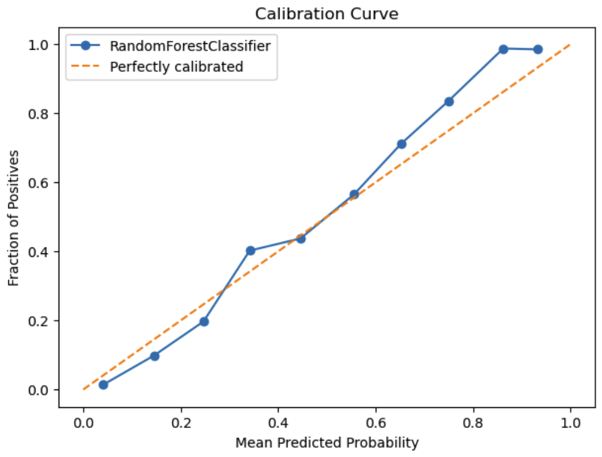

# Telco Customer Churn Prediction

This project aims to assist customer retention team in identifying at-risk customers and making informed decisions to improve retention strategies. The solution includes two machine learning models tailored for different business needs, a user-friendly Streamlit web application, and a FastAPI-based API deployed on AWS Lambda for seamless integration into technical workflows.

## Project Overview

### Problem Statement
Customer churn is a critical challenge in the telecom industry. Retaining customers is more cost-effective than acquiring new ones. This project provides tools to identify potential churners and understand their likelihood of churning, enabling targeted and effective retention efforts.

### Objectives
- Build a high-recall model to catch as many prospective churners as possible.
- Build a probability-calibrated model to accurately estimate churn probabilities.
- Deploy a prediction system with flexible user interaction options.

### Dataset
The dataset is from [Kaggle](https://www.kaggle.com/datasets/johnflag/jb-link-telco-customer-churn). It includes various customer-related features such as:
- Customer demographics (e.g., age, gender, number of dependents).
- Services subscribed (e.g., Internet service, unlimited data, online security).
- Others (e.g., payment method, monthly charges, total refunds).

---

## Models

### 1. **Model 1: Recall-Optimized Model**
- **Purpose**:
  - Predict churn classes (churn/non-churn).
  - Identify as many churners as possible to minimize false negatives (churners predicted as non-churners).
- **Use Case**: Useful for broad retention campaigns to target a larger group of at-risk customers as well as high-stakes situations where losing any customer could lead to significant revenue loss.
- **Key Metric**: Model 1 achieved a **Recall** of 0.9, meaning it correctly identified 90% of churners.

### 2. **Model 2: Brier Score-Optimized Model**
- **Purpose**:
  - Predict churn probabilities (0-1).
  - Provide reliable churn probabilities with well-calibrated predictions.
- **Use Case**: Useful for more tailored interventions especially when retention strategies are based on predicted probabilities rather than just the predicted classes. Also well-suited for precise retention efforts when resources are limited.
- **Key Metric**: Model 2 achieved a **Brier Score** of 0.08 (where 0 is perfect accuracy and 1 is the worst), indicating that the model’s predicted probabilities are closer to the actual outcomes (0 or 1). The model is also well-calibrated as can be seen below:

## Recommendations
- Use Model 1
- Use Model 2

## Making Predictions
1. **Streamlit Web App**: A simple and interactive web application for users to input customer data and receive churn predictions.
2. **API**: A FastAPI API hosted on AWS Lambda

---

## Tools & Technologies

1. **Streamlit Web Application**: 
   - **For Non-Technical Users**: 
     - Allows customer retention teams to interact with the models.
     - Two modes:
       - Predict for a single customer with a detailed probability score.
       - Batch predictions via file upload for large-scale analysis.
     - **Output**: Downloadable CSV file with predictions.

2. **FastAPI API**:
   - **For Technical Users**:
     - A RESTful API deployed on AWS Lambda for integration into technical systems.
     - Enables automated and large-scale model usage.

---

## Deployment

- **Streamlit Web App**:
  - Hosted locally or on a cloud platform for easy access by customer retention teams.
  - Interactive interface with no need for technical expertise.

- **FastAPI API**:
  - Deployed on AWS Lambda for scalability and reliability.
  - Designed for technical teams to integrate churn prediction into existing systems.

---

## How to Use

### When to Use Each Model
- **Recall-Optimized Model**:
  - Early churn intervention campaigns.
  - Scenarios where missing a churner has a high impact on revenue or business reputation.

- **Brier Score-Optimized Model**:
  - Post-intervention analysis or high-stakes decisions.
  - Situations requiring precise insights into churn likelihood for resource prioritization.

### Where to Use
- **Streamlit Web App**:
  - Ideal for non-technical users like customer retention teams.
  - Enables quick predictions and insights without requiring programming knowledge.

- **FastAPI API**:
  - Suitable for technical teams building workflows or dashboards.
  - Provides programmatic access to the models for custom use cases.

---

## Key Features

- **Recall-Optimized Model**: Maximizes recall to capture potential churners.
- **Brier Score-Optimized Model**: Reliable churn probability predictions with calibration curve validation.
- **Streamlit Web App**: Simple, intuitive interface for single and bulk predictions.
- **FastAPI API**: High-performance API for seamless integration.
- **AWS Lambda Deployment**: Scalable and cost-effective infrastructure.

---

## Conclusion

This project equips customer retention teams with the tools to make informed, data-driven decisions. By leveraging both models appropriately, businesses can improve their churn management strategies, optimize resources, and enhance customer satisfaction.

For questions or feedback, feel free to [contact me](mailto:your-email@example.com).
